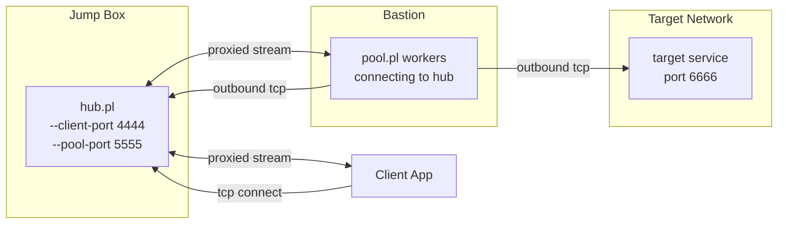

# contun.pl

contun is a set of Perl scripts to help establish a network tunnel from one host to another in situations when the host with the target service cannot bind any ports externaly and must connect out. There are typically two to three hosts involved the final target that the isolated host can access, the isolated or bastion host, and the jump box host. The end result should be that there's a port exposed on the jump box host that when connected to is proxied to the target host and port via the isolated bastion host.

jump_client_app -> jump:4444 <- jump_hub.pl -> jump:5555 <--- bastion_pool.pl ---> target:6666



The isolated bastion host can only operate in a connect-connect tunnel configuration (i.e. connect to the target host and port, and connect to a jump box server and port). The connections on the isolated bastion host are done with pool.pl, and the connections on the jump box host are done using hub.pl.

`hub.pl` operates in listen-listen waiting for a conection on the jump box external side, and forwarding data to the local listening side and vice versa. `pool.pl` operates in connect-connect by connecting to the jumpbox server, and once a connection is established with the hub.pl's local listen side, forwarding that to the target host and port and vice versa.

Of course, building a simple multi-hop tunnel like this could be done with socat quite easily:

jumpbox: socat tcp-listen:4444,bind=127.0.0.1 tcp-listen:5555
bastion: socat tcp:jumpbox:5555 tcp:target:6666

But, the problem you'll have is with concurrency. Even if you add the `fork` keyword to the jumpbox's localhost listener, the use of the second socat limits the ability to associate a connection across the two socat pairs.

To solve this contun's pool sets up a pool of workers on the isolated bastion host that each initiate a connection to contun's hub, which in turn can then handle multiple concurrent connections to the local listener.

## Usage

1. **Jump box:** run `hub.pl` to expose a local listener that downstream clients connect to and to wait for worker connections from the bastion.

   ```bash
   perl hub.pl \
     -c 4444 \
     -C 127.0.0.1 \
     -p 5555 \
     -P 0.0.0.0
   ```

   * `-c, --client-port` sets the port the jump box will expose to consumers (e.g. SSH, HTTP clients).
   * `-C, --client-bind` limits which interface that listener binds to (defaults to `127.0.0.1`).
   * `-p, --pool-port` defines the port where bastion workers phone home.
   * `-P, --pool-bind` allows binding that worker listener to a specific interface (defaults to `0.0.0.0` for all).

2. **Bastion:** run `pool.pl` to maintain a pool of outbound connections back to `hub.pl`, and onward connections to the otherwise unreachable target host.

   ```bash
   perl pool.pl \
     -j jumpbox.internal \
     -p 5555 \
     -t target.internal \
     -T 6666 \
     -w 4
   ```

   * `-j, --hub-host` is the jump box address that workers dial.
   * `-p, --hub-port` must match the hub's pool listener port.
   * `-t, --target-host` and `-T, --target-port` define where each worker connects once paired.
   * `-w, --workers` controls how many concurrent worker processes stay ready (defaults to `4`).
   * `-r, --retry-delay` tweaks how long a worker waits before redialling after a failure.

Once both sides run, `hub.pl` waits for clients to connect on the `--client-port`. For every incoming connection it pairs the client with the next idle worker. The worker then dials the target and streams bytes both ways. When either side closes the connection the worker returns to the idle pool, ready for the next client. Because the hub retains a pool of pre-established worker sockets, multi-connection clients (for example modern browsers, HTTP/2 reverse proxies, or tools that pipeline requests) behave as if they connected directly to the target service.
