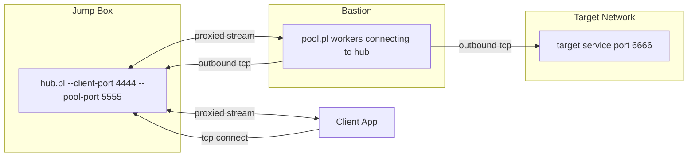

# contun.pl - Concurrent Tunnel

contun is a set of Perl scripts (or go binaries too) to help establish a network tunnel from one host to another in situations when the host that can access the target service cannot bind any ports externaly and must connect out (like a reverse shell). The isolated bastion host that has access to the private network makes a connection to a jump box the attacker can access. The jump box will have a port available that can be forwarded to the private network. `contun` supports either one to one port forwwards in direct mode or can act as a reverse SOCKS5 proxy in socks mode.

Here's a simple diagram (with multiple dashes indicating cross-host comms)

jump_client_app -> jump:4444 <- jump_hub.pl -> jump:5555 <--- bastion_pool.pl ---> target:6666

Or a more detailed one:



The isolated bastion host can only operate in a connect-connect tunnel configuration (i.e. connect to the target host and port, and connect to a jump box server and port). The connections on the isolated bastion host are done with `pool.pl`, and the connections on the jump box host are done using `hub.pl`.

`hub.pl` operates in listen-listen waiting for a conection on the jump box external side, and forwarding data to the local listening side and vice versa. `pool.pl` operates in connect-connect by connecting to the jumpbox server, and once a connection is established with the `hub.pl`'s local listen side, forwarding that to the target host/s and port/s and vice versa.

Of course, building a simple multi-hop tunnel like this could be done with socat quite easily:

```
# jumpbox
socat tcp-listen:4444,bind=127.0.0.1 tcp-listen:5555

# bastion
socat tcp:jumpbox:5555 tcp:target:6666
```

But, the problem you'll have is with concurrency. Even if you add the `fork` keyword to the jumpbox's localhost listener, the use of the second socat limits the ability to associate a connection across the two socat pairs. Other solutions like looping the jumpbox's socat are imperfect and result in dropped connections.

To solve this contun's pool sets up a pool of workers on the isolated bastion host that each initiate a connection to contun's hub, which in turn can then handle multiple concurrent connections to the local listener.

## Usage

1. **Jump box:** run `hub.pl` to expose a local listener that downstream clients connect to and to wait for worker connections from the bastion.

   ```bash
   perl hub.pl \
     -c 4444 \
     -C 127.0.0.1 \
     -p 5555 \
     -P 0.0.0.0 \
     -m socks
   ```

   * `-c, --client-port` sets the port the jump box will expose to consumers (e.g. SSH, HTTP clients).
   * `-C, --client-bind` limits which interface that listener binds to (defaults to `127.0.0.1`).
   * `-p, --pool-port` defines the port where bastion workers phone home.
   * `-P, --pool-bind` allows binding that worker listener to a specific interface (defaults to `0.0.0.0` for all).
   * `-m, --mode` selects `direct`, `socks`, or `auto` (default). In the example above the hub expects SOCKS-aware workers and clients.

2. **Bastion:** run `pool.pl` to maintain a pool of outbound connections back to `hub.pl`, and onward connections to the otherwise unreachable target host.

   ```bash
   perl pool.pl \
     -j jumpbox.internal \
     -p 5555 \
     -m socks \
     -w 4
   ```

   * `-j, --hub-host` is the jump box address that workers dial.
   * `-p, --hub-port` must match the hub's pool listener port.
   * `-m, --mode` selects `direct` (fixed target) or `socks` (per-connection destination). SOCKS mode ignores `-t/-T`.
   * `-t, --target-host` and `-T, --target-port` define where each worker connects once paired when running in direct mode.
   * `-w, --workers` controls how many concurrent worker processes stay ready (defaults to `4`).
   * `-r, --retry-delay` tweaks how long a worker waits before redialling after a failure.

Once both sides run, `hub.pl` waits for clients to connect on the `--client-port`. For every incoming connection it pairs the client with the next idle worker. The worker then dials the target and streams bytes both ways. When either side closes the connection the worker returns to the idle pool, ready for the next client. Because the hub retains a pool of pre-established worker sockets, multi-connection clients (for example modern browsers, HTTP/2 reverse proxies, or tools that pipeline requests) behave as if they connected directly to the target service.

### Pool implementations

You can choose between two pool implementations that speak the same wire protocol to `hub.pl`:

* **`pool.pl` (Perl)** – the original script, handy on bastions where only Perl is available and nothing can be compiled.
* **`poolgo` (Go)** – a drop-in replacement that uses native goroutines instead of forking. We added it so you can cross-compile static binaries easily (`CGO_ENABLED=0`) and deploy without needing a Perl runtime. `poolgo` interoperates with the existing `hub.pl` without any hub changes.

Both binaries accept the same flags and support `direct` and `socks` modes.

#### Prebuilt Go binaries

If you don’t want to install Go locally, grab a precompiled `poolgo` from the CI pipeline:

1. Open the workflow run list at https://github.com/singe/contun.pl/actions/workflows/ci.yml.
2. Pick a green (successful) run that matches the commit you care about.
3. Scroll to the bottom of the run summary and expand the **Artifacts** section.
4. Download the archive that matches your platform (e.g. `poolgo-linux-amd64`, `poolgo-darwin-arm64`, `poolgo-windows-amd64.exe`).
5. Extract it and run with the same flags you would pass to `pool.pl`.

### Modes

contun supports three operating modes that are coordinated between the hub and the pool:

* `direct` – pool workers advertise a single target host/port and reuse it for every session. The hub passes raw TCP traffic straight through with no additional handshakes. This is ideal when the bastion can already resolve and reach the destination the jump box operator wants.
* `socks` – downstream clients speak SOCKS5 to `hub.pl`. The hub parses each CONNECT command and forwards the requested destination to the pool worker, which connects on demand. This lets the jump box expose a generic SOCKS proxy rather than a single endpoint.
* `auto` – the hub waits for the first worker HELLO and adopts its mode (`direct` or `socks`). Mixed-mode pools are rejected (with log messages) until the hub is restarted.

Choose the same mode on both sides. If operators need to switch, restart `hub.pl` alongside `pool.pl` so the active mode can be reset cleanly.

### Hub ↔ Pool wire protocol

`hub.pl` and `pool.pl` talk over a simple line-oriented control protocol before byte streaming begins:

1. **Worker handshake:** on connect the pool sends `HELLO 1 <mode>` or `HELLO 1 direct DEST <atype> <addr> <port>`. The hub replies `OK` (or an error and closes).
2. **Client request:** when the hub pairs a client with an idle worker it sends `REQUEST CONNECT <atype> <addr> <port>`. In direct mode the address comes from the worker’s HELLO; in socks mode it comes from the client’s SOCKS request. `<atype>` is `ipv4`, `ipv6`, or `domain` and `<addr>` is plain text.
3. **Worker reply:** the pool attempts the outbound connection and answers with `REPLY <status> <atype> <addr> <port>`. `status 0` means success (other codes follow SOCKS semantics). The hub then either confirms success to the SOCKS client or tears everything down on error. After `REPLY 0…` both sides switch to raw bidirectional streaming until one closes.

Any unexpected line or buffer limit breach causes the corresponding socket to be closed; the peer gets a terse log message so operators can diagnose mismatches quickly.

# Why Perl in this year of our Lord 2025

Because that's the only interpreter that was on the bastion in a pentest when I made the early version of this tool!
